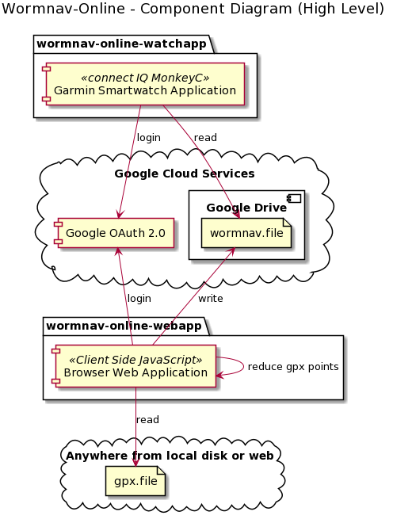
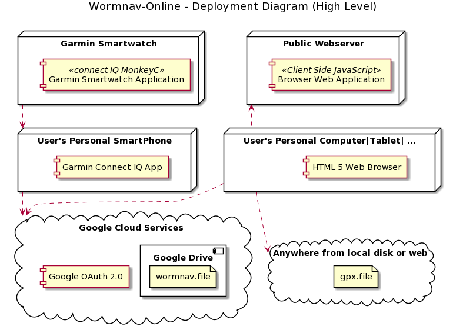

# Software Design - High Level 

The basic design concepts are:

- Create a Garmin Smartwatch Application to access a wormnav file on google drive
- Create a Browser Web Application to reduce gpx track points, so they can be read by the Garmin Smartwatch Application. And to store the reduced track points in a wormnav file on Google Drive.

## Component Diagram

The basic requirements are:

- Garmin Smartwatch Application needs to be authorized to access the google drive of the user
- The Browser Web Application needs to be authorized to access the google drive of the user
- The Browser Web Application will have the functionality to reduce the track points in a gpx file.

## Deployment

The basic concepts are:

- The user needs to have a [Google account](https://account.google.com/)
- Currently you need a [Google Developer Account](https://developers.google.com/) to let the Applications access [Google OAuth 2.0](https://developers.google.com/identity/protocols/oauth2) and [Google Drive](https://developers.google.com/drive). This is because curently there are no plans to provide a ready to use solution.
- The Garmin Smartwatch Application needs to be installed on the smartwatch. Currently there are no plans to put this app into the Garmin Store. Use your installed [Connect IQ Development SDK](https://developer.garmin.com/connect-iq/)
- The Browser Web Application needs to be installed on a public webserver (Currently there are no plans to provide a public webserver. You could use [Express JS](https://expressjs.com/de/) to provide that app from a local webserver)
- The [Garmin Connect IQ App](https://connect.garmin.com/) needs to be installed on the users smartphone

